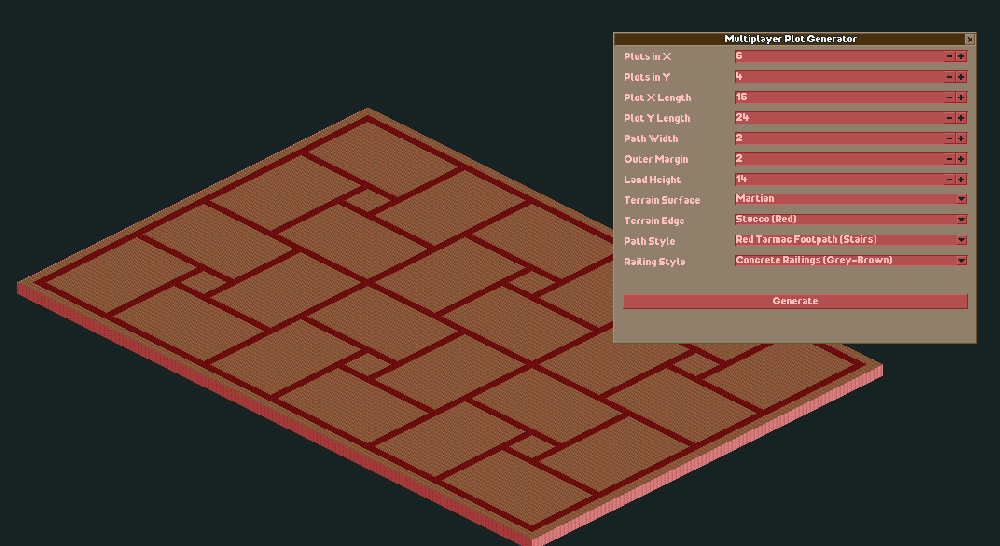

# Multiplayer Plot Generator plugin for OpenRCT2

Multiplayer Plot Generator is an OpenRCT2 plug-in that creates a clean grid of interlocking build plots for multiplayer parks.

It is intended for flat, empty workbench maps where each player or team needs a clearly separated building area with shared paths between plots.

## Current features

- Generate rectangular multiplayer build plots from an in-game window.
- Choose the number of plots in the X and Y directions.
- Configure plot length, plot width, path width, outer margin, and land height.
- Alternate plot orientation in a checkerboard pattern.
- Resize the map to fit the generated layout.
- Level the generated map area before placing paths.
- Choose loaded terrain surface, terrain edge, path surface, and railing styles.
- Place actual OpenRCT2 footpaths for the shared corridors.
- Set the generated land as owned.

## Installation

1. Download `multiplayer-plot-generator.js` from the latest GitHub release.
2. Put the downloaded file into your OpenRCT2 `plugin` folder.
   - The easiest way to find this folder is to launch OpenRCT2, click and hold the red toolbox on the main menu, then choose "Open custom content folder".
   - On Windows, the folder is usually `C:/Users/<YOUR NAME>/Documents/OpenRCT2/plugin`.
3. Open a park or scenario editor map.
4. Open the map menu and choose `Generate multiplayer plots`.

If you already had the plugin installed, you can overwrite the old `multiplayer-plot-generator.js` file.

## Usage

1. Start from a flat, empty map or workbench.
2. Open `Generate multiplayer plots` from the map menu.
3. Set the plot count, plot dimensions, path width, outer margin, land height, terrain style, and path style.
4. Click `Generate`.

The plugin temporarily enables sandbox mode while generating so map resizing, land changes, ownership changes, and path placement are less likely to fail.

## Notes

- This plugin is designed for empty maps. It removes existing paths before generating the new layout.
- It resizes the map to the minimum size required by the selected settings.
- It levels the generated map area to the selected land height.
- The selected path width is used as the shared corridor spacing around the plot shapes.
- The generated paths use loaded footpath surface and railing objects from the current park.

## Multiplayer

This plugin prepares multiplayer build plots, but generation should be treated as a map setup action. For multiplayer servers, install the plugin on the server so the menu item and script are available there.

Players need the relevant map-editing permissions for resizing, land editing, ownership changes, and path placement.

## For developers

This repository currently ships the plugin as a single JavaScript file:

- `multiplayer-plot-generator.js`: the OpenRCT2 plugin script
- `openrct2.d.ts`: OpenRCT2 scripting API declarations used as a local reference while developing

To test a local change, copy `multiplayer-plot-generator.js` into your OpenRCT2 `plugin` folder and restart OpenRCT2.

## AI assistance disclosure

This plugin was created with assistance from OpenAI Codex. Codex helped generate, revise, and document the plugin, while the repository remains available for review, modification, and improvement by the OpenRCT2 community.

## License

MIT
